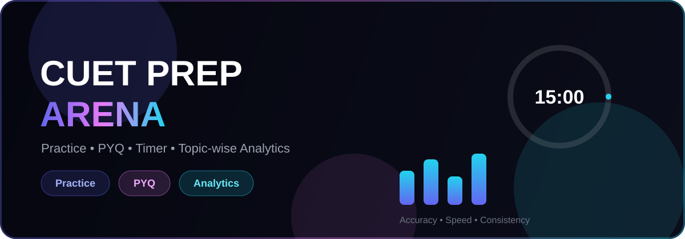

<div align="center">
  
</div>

<div align="center">


**Practice smarter. Score higher. Master CUET 2027.**

</div>

---

## Features

- Practice Mode with custom subject, difficulty, timer aur question count
- PYQ Mode with exam-like timer and marking scheme
- Question palette with mark for review
- Keyboard shortcuts (1-4, arrows, M, S)
- Instant score calculation with negative marking
- Topic-wise analytics and weak topic detection
- Dashboard with attempt history and growth tracking
- Settings for auto submit, instant explanation and default timer
- Premium dark glassmorphic UI with animations
- Local progress tracking

## Tech Stack

- Next.js
- React
- TypeScript
- Tailwind CSS
- Zustand
- Zod
- canvas-confetti
- Lucide Icons

## Project Structure

```txt
src/
├── app/
│   ├── api/
│   ├── dashboard/
│   ├── practice/
│   ├── pyq/
│   ├── quiz/
│   ├── results/
│   └── settings/
├── components/
│   ├── dashboard/
│   ├── home/
│   ├── layout/
│   ├── pyq/
│   ├── quiz/
│   ├── results/
│   ├── settings/
│   └── ui/
├── hooks/
├── lib/
├── store/
└── types/

data/
├── pyq/
├── questions/
├── subjects/
└── topics/

scripts/
├── import-pyqs.ts
├── seed-demo.ts
└── validate-questions.ts
```

## Local Setup

```bash
npm install
```

```bash
npm run dev
```

Open:

```txt
http://localhost:3000
```

## Scripts

| Command | Description |
|---|---|
| `npm run dev` | Start development server |
| `npm run build` | Production build |
| `npm run start` | Start production build |
| `npm run lint` | Run linting |
| `npm run typecheck` | TypeScript check |
| `npm run validate:data` | Validate question JSON files |
| `npm run import:pyq` | Combine PYQ JSON into generated bank |
| `npm run seed:demo` | Create demo question bank |

## Question Data Format

Questions are stored as JSON in `data/questions` and `data/pyq`.

```json
[
  {
    "id": "unique_question_id",
    "section": "domain",
    "subject": "Mathematics",
    "topic": "Probability",
    "difficulty": "medium",
    "question": "What is the probability of getting heads in a coin toss?",
    "options": ["0", "1/2", "1", "2"],
    "correctIndex": 1,
    "explanation": "Head and tail are equally likely.",
    "year": 2023,
    "source": "pyq"
  }
]
```

## Keyboard Shortcuts

| Key | Action |
|---|---|
| `1 - 4` | Select option |
| `← / →` | Previous / Next question |
| `M` | Mark for review |
| `S` | Submit quiz |

## PYQ Disclaimer

This project ships with sample and PYQ-style placeholder questions for structure and practice. If you add official previous-year questions, make sure you have the right to use that content.

## License

MIT
